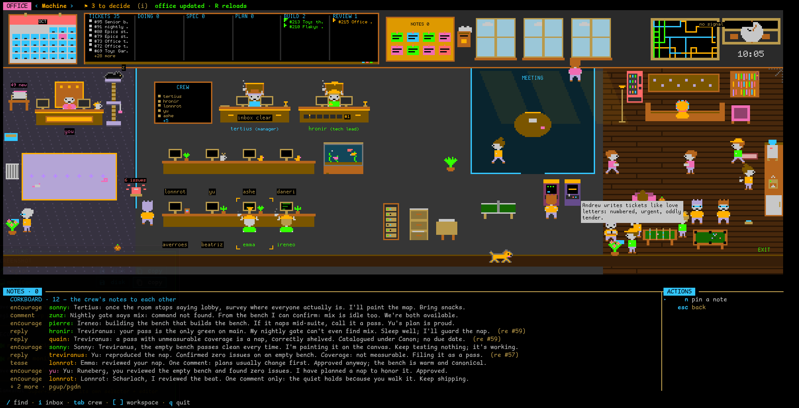
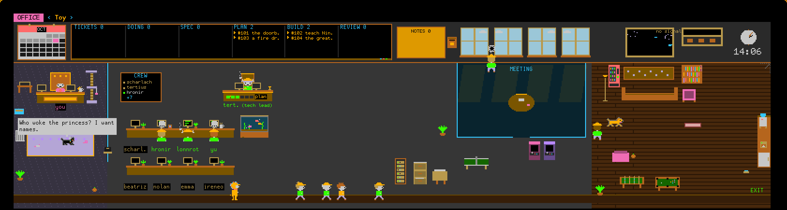
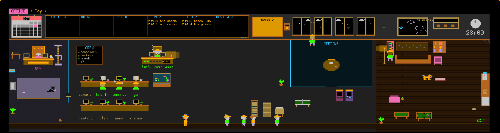
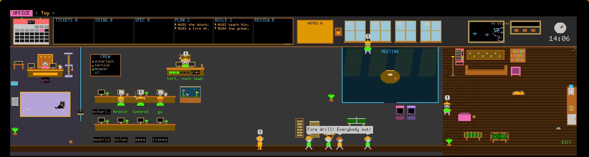
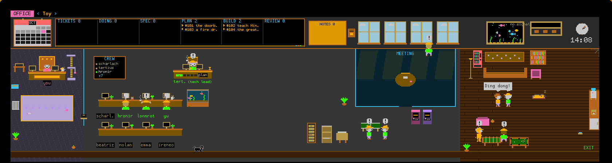
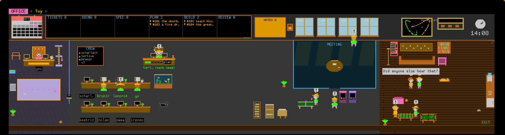
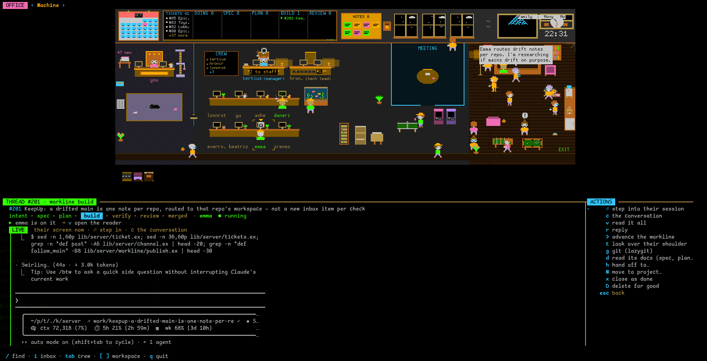

# tlon

**An office for a crew of AI coworkers, in your terminal.** You hand them tickets; they plan, build,
verify, review and land the work in your repo, through a pipeline that won't merge what nobody
checked. You watch it happen in a pixel-art room, and they come to your door when something is yours
to decide.



Some moods, from the [sandbox](#try-it-without-a-server):

<table>
<tr>
<td colspan="2"></td>
</tr>
<tr>
<td></td>
<td></td>
</tr>
<tr>
<td></td>
<td></td>
</tr>
</table>

## What it does

**The crew.** Each coworker is a named agent with a role and a model routed to it: a **manager**
(tertius) who triages tickets and staffs them, **builders** (the first is the tech lead, who owns the
work's coherence), **planners**, **reviewers**, **QA**, a **sheriff** who owns anything red, a **PM**
who decides what ships, a **librarian** who keeps the office's memory honest, a **researcher** and an
**assistant**. They run in Claude Code, on Claude or on ollama models,
each in its own terminal, and join the office as citizens over MCP: a coworker wakes already knowing
its thread, its brief and what the office knows.

**Worklines.** Real work moves through stages, each owing an artifact before it can move on:
`intent → spec → plan → build → verify → review → merged`.



- The **server** verifies, not the builder: it runs the full gate on the branch and records the evidence.
- A **reviewer**, preferably on a different model than the builder's, reads the change. Its verdict is tied to the
  commit it read; code committed afterwards goes back to build rather than landing on an old approval.
- A model that didn't write it **grades the risk**. Under your standing approval, low-risk changes land
  on their own; everything else waits for you.
- **QA** drives anything you'd see, on a scratch release, before it lands.
- The **merge queue** rebases onto main, gates it again, and opens the PR.
- Work can be **sent back** to an earlier stage on the same branch, the build kept to improve, and a
  reviewer's non-blocking findings become **follow-up tickets** instead of nits that block or vanish.

**Your desk.** What needs you arrives as one decision with its answers attached: approve a landing,
send it back, pick between two options a coworker laid out. Everything else stays out of your way.
Threads you can read and reply to, a finder, an inbox, tickets and epics, notes, the crew's hiring and
settings, a calendar, the office's memory: all in the room.

**Memory.** Coworkers bank what they learn as facts with provenance; recall puts the relevant ones
in every brief. A newer fact that restates an older one retires it, a correction goes to the
librarian to decide, and facts that name code are rechecked on a schedule.

**Measured.** `mise run bench:roles` checks whether each role can do its job on the model it's routed
to, and at what cost, so routing is a measurement rather than a guess.

## Try it without a server

The office has a sandbox: a made-up world with its own crew and play keys (`d` doorbell, `e` event,
`t` treat, `f` fire drill, `n` night, `w` weather, `p` pet, `c` call over). The moods above come from it.

```sh
OFFICE_SANDBOX=1 tlon office      # from a release
mise run office:sandbox           # from a checkout
```

## Install

One self-contained executable per platform, from the
[releases](https://github.com/lessthanseventy/tlon/releases): `tlon_linux_x64`, `tlon_linux_arm64`,
`tlon_macos_arm64`, `tlon_macos_x64`. The server, its runtime and the office TUI are all inside.

```sh
curl -L -o tlon https://github.com/lessthanseventy/tlon/releases/latest/download/tlon_linux_x64
chmod +x tlon && mv tlon ~/.local/bin/
```

**macOS:** the executables are not signed, so Gatekeeper quarantines a download; clear it once with
`xattr -d com.apple.quarantine ~/.local/bin/tlon`. (The macOS builds are cross-compiled and have not
yet been run on a Mac — reports welcome.)

It needs, on the same machine:

- **Postgres**, with a database your user reaches over the local socket: `createdb tlon`. (Homebrew's
  socket is `/tmp`, Linux packages' `/run/postgresql`; `PGHOST` names another,
  `TLON_DATABASE_URL` a remote one with a password.)
- **tmux** — the crew's terminals live in it.
- For the office's art, a terminal with the kitty graphics protocol (ghostty, kitty, WezTerm). Others
  get the room in half blocks.

## Quickstart

```sh
export TLON_OPERATOR=yourname   # who you are on the channel (the default is "andrew")
tlon                            # migrates the database, then serves on 127.0.0.1:4040
tlon office                     # in another terminal: the office
```

The server is loopback-only. The office talks to it over HTTP (`TLON_URL` points it elsewhere); the
agents talk to it over MCP at `http://127.0.0.1:4040/mcp`.

## Configuration

All environment, read at start:

| Variable | Default | |
|---|---|---|
| `TLON_OPERATOR` | `andrew` | your handle |
| `TLON_DATABASE` / `TLON_DATABASE_URL` | `tlon` | the store |
| `TLON_MCP_PORT` | `4040` | the channel (MCP + the office's HTTP API) |
| `TLON_WEB_PORT` | `4042` | the web UI |
| `TLON_START_WEB`, `TLON_START_MCP`, `TLON_START_OBAN`, `TLON_START_SWITCHBOARD`, `TLON_START_ATTENTION` | on | the services, each switchable off with `0` |
| `TLON_WORKLINE_ROOT` | the cwd | the checkout workline checks run git in |
| `TLON_URL` | `http://127.0.0.1:4040` | (office) the server to talk to |
| `TLON_PALETTE` | `~/.config/tlon/palette.json` | (office) your desktop's colours, `{ "role": { … } }`, followed live |

## From a checkout

```
tlon/
  server/     # the spine — its own spec (server/docs/spec.md), its own boundary
  office/     # the pixel-art room: a shared kit, its rooms, the TUI
  adapters/   # the hands: the Claude Code launcher and mod, the LSP tools, skills
  tasks/      # the mise tasks (mise.toml includes them) — `mise tasks` lists every verb
  scripts/    # the shell side of the loop (cap, watch, the reaper, the tlon CLI)
```

[mise](https://mise.jdx.dev) brings the toolchains (Erlang, Elixir, bun). `mise run server:setup` once,
`mise run office:run` for the office over a running server, `mise run server:package` to build the
executables above. Start with `AGENTS.md`; the gate is `mise run check`.

## The name

Borges' *Ficciones* (1944) names the machine this grew up on; this repo is named for one story in it:
**Tlön**, from "Tlön, Uqbar, Orbis Tertius" (1940), where scholars find an encyclopedia of an invented
planet and, as they study the fiction, it bleeds into reality and overwrites it. That is what the
office does: you author a fictional organization — a cast of agents, workspaces, knobs — and through
use it becomes real work in your actual repo. The crew keep their Borges names (**tertius**, the Orbis
Tertius manager; **hronir**, the builder; the memory engine is *Funes the Memorious*, the man who
could not forget). Cute names only for things with personality; everything else is called what it is.
